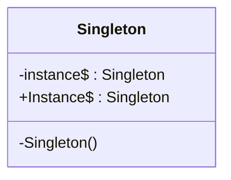
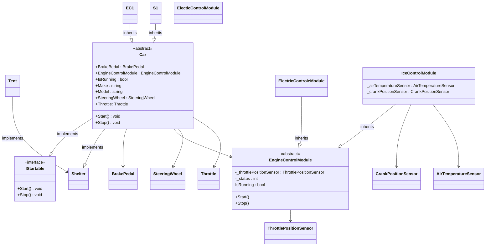

# 03 - The Four Pillars

Example Diagrams

## Class Diagram

```mermaid
classDiagram
    class Singleton {
        -instance$ : Singleton
        +Instance$ : Singleton
        -Singleton()
    }
```

```mermaid
classDiagram
class IStartable {
    <<interface>>
	+Start() void
	+Stop() void
}
Tent --> Shelter : implements
class S1
class EC1
EC1 --|> Car : inherits
S1 --|> Car : inherits
class Car {
    <<abstract>>
    +BrakeBedal : BrakePedal
    +EngineControlModule : EngineControlModule
    +IsRunning : bool
    +Make : string
    +Model : string
    +SteeringWheel : SteeringWheel
    +Throttle: Throttle
    +Start() void
    +Stop() void
}
Car --|> IStartable : implements
Car --|> Shelter : implements
Car --> BrakePedal
Car --> EngineControlModule
Car --> SteeringWheel
Car --> Throttle

class ElecticControlModule
ElectricControleModule --|> EngineControlModule : inherits
class IceControlModule {
    -_airTemperatureSensor : AirTemperatureSensor
    -_crankPositionSensor : CrankPositionSensor
} 
IceControlModule --|> EngineControlModule : inherits
IceControlModule --> CrankPositionSensor
IceControlModule --> AirTemperatureSensor


class EngineControlModule {
    <<abstract>>
    -_throttlePositionSensor : ThrottlePositionSensor
    -_status : int
    IsRunning : bool
    +Start()
    +Stop()
}
EngineControlModule --> ThrottlePositionSensor
```